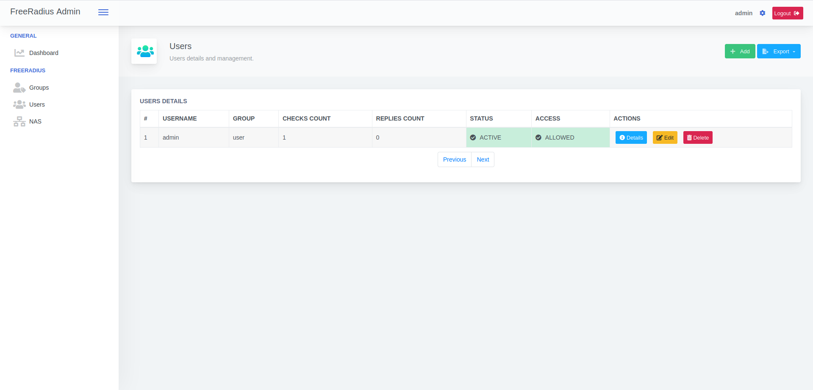
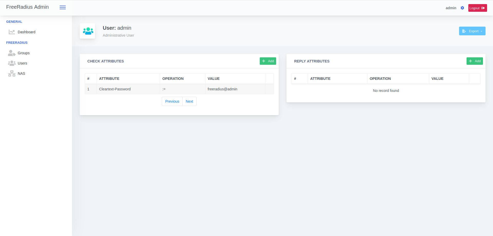
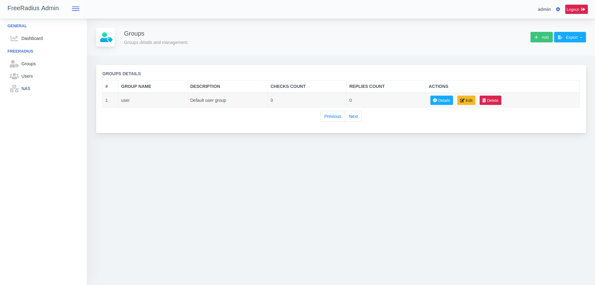
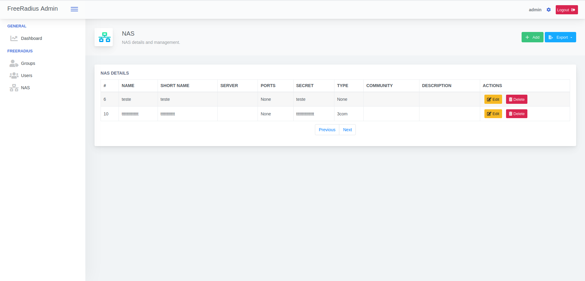
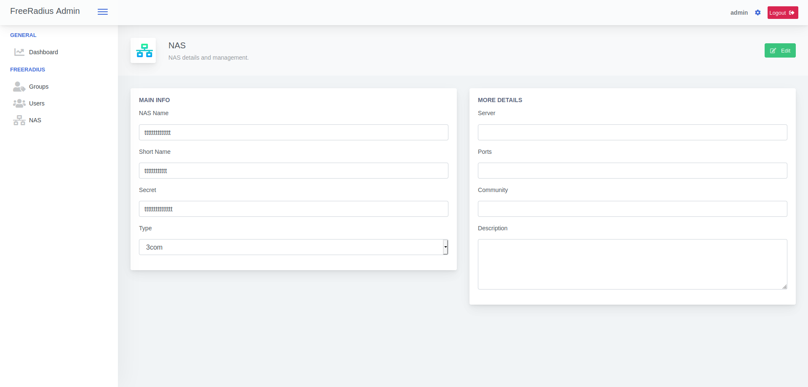

# flask-freeradius-admin

Flask-FreeRadius-Admin is a visual editor for the FreeRadius server tables. You can use to visualize the FreeRadius authentication flow and edit users, groups and NAS data.


<p align="center">
  
  
  
  
  
</p>  

## Installing

Flask-FreeRadius-Admin comes with a *Docker Compose* file to configure your FreeRadius server to use the SQL module, a Postgres database, and the Flask app. If you already have a FreeRadius server with SQL configured, feel free to use only the `flask_app` directory and follow the Dockerfile installation instructions to build it in your machine. You may need to check the `docker-compose.yml` file to set the right environment variables.

***PS:** If you want to enable the NAS types list, you may need to copy your FreeRadius dictionaries folder to your Flask app machine and set the `DICTIONARIES_PATH` value in the `flask_app/app/config.py` file.*

### Docker installation steps

1. Install Docker and Docker-Compose
```
apt install docker docker-compose
```

2. Clone the repository
```
git clone https://github.com/juliarizza/flask-freeradius-admin.git
```

3. Enter the project
```
cd flask-freeradius-admin
```

4. Run Docker-Compose
```
docker-compose up -d
```

If you want to check the container logs, get the container ID using `ps`:
```
docker ps
docker logs {container_id}
```

If you want to access either the database or the freeradius shell:
```
docker ps
docker exec -it {container_id} /bin/bash
```

If you want to access the application shell:
```
docker ps
docker exec -it {container_id} /bin/sh
```

## Standalone use

If you want execute in standalone mode, bellow instructions, using Ubuntu Server 18.04


```bash
apt install -y git python3-pip postgresql postgresql-contrib postgresql-10 \
freeradius freeradius-utils freeradius-postgresql gunicorn3
```


*It will be necessary to edit several configuration files*

```bash
cp /etc/freeradius/3.0/mods-config/sql/main/postgresql/queries.conf /etc/freeradius/3.0/mods-config/sql/main/postgresql/queries.bkp
```

```bash
sed -i 's/(username, pass, reply, authdate)/(username, pass, reply, calledstationid, callingstationid, authdate)/g' /etc/freeradius/3.0/mods-config/sql/main/postgresql/queries.conf

sed -i "449i\                        '%{NAS-IP-Address}', \\\\" /etc/freeradius/3.0/mods-config/sql/main/postgresql/queries.conf

sed -i "450i\                        '%{Calling-Station-Id}', \\\\" /etc/freeradius/3.0/mods-config/sql/main/postgresql/queries.conf
```

```bash
cp /etc/freeradius/3.0/mods-available/sql /etc/freeradius/3.0/mods-available/sql.bkp
```

```bash
ln -s /etc/freeradius/3.0/mods-available/sql /etc/freeradius/3.0/mods-enabled/
```

```bash
sed -i 's/driver = "rlm_sql_null"/driver = "rlm_sql_postgresql"/' /etc/freeradius/3.0/mods-available/sql
sed -i 's/dialect = "sqlite"/dialect = "postgresql"/' /etc/freeradius/3.0/mods-available/sql
sed -i '/server = "localhost"/s/^#//g' /etc/freeradius/3.0/mods-available/sql
sed -i '/port = 5432/s/^#//g' /etc/freeradius/3.0/mods-available/sql
sed -i '/login = "radius"/s/^#//g' /etc/freeradius/3.0/mods-available/sql
sed -i '/password = "radpass"/s/^#//g' /etc/freeradius/3.0/mods-available/sql
sed -i '/read_clients = yes/s/^#//g' /etc/freeradius/3.0/mods-available/sql
sed -i '/read_groups = yes/s/^#//g' /etc/freeradius/3.0/mods-available/sql
sed -i '/read_profiles = yes/s/^#//g' /etc/freeradius/3.0/mods-available/sql
```

```bash
sed -i 's/radpass/YOUR_RADIUS_PASSWORD/' /etc/freeradius/3.0/mods-available/sql
```

```bash
chown -R freerad:freerad /etc/freeradius/3.0/mods-enabled/sql
```

```bash
unlink /etc/freeradius/3.0/sites-enabled/inner-tunnel
```

```bash
sed -i '/ldap/s/^/#/g' /etc/freeradius/3.0/sites-available/default
sed -i '/files/s/^/#/g' /etc/freeradius/3.0/sites-available/default
sed -i '682 s/# *//' /etc/freeradius/3.0/sites-available/default
```

```bash
cp /etc/freeradius/3.0/mods-config/attr_filter/access_reject /etc/freeradius/3.0/mods-config/attr_filter/access_reject.bkp
```

```bash
sed -i '19,20d' /etc/freeradius/3.0/mods-config/attr_filter/access_reject
sed -i '18 s/ANY,/ANY/' /etc/freeradius/3.0/mods-config/attr_filter/access_reject
```

```bash
sed -i 's/ipaddr = 127.0.0.1/ipaddr = 0.0.0.0/' /etc/freeradius/3.0/clients.conf
sed -i 's/ipv6addr\t= ::1/ipv6addr = ::0/' /etc/freeradius/3.0/clients.conf
sed -i 's/testing123/freeradiusadmin/' /etc/freeradius/3.0/clients.conf
```

```bash
systemctl enable freeradius.service
```

```bash
cp /etc/postgresql/10/main/pg_hba.conf /etc/postgresql/10/main/pg_hba.bkp
```

```bash
sed -i '90 s/peer/md5/' /etc/postgresql/10/main/pg_hba.conf
systemctl restart postgresql
```

Download Flask Freeradius Admin on Github

```bash
cd /opt/
git clone https://github.com/vialivre/flask-freeradius-admin.git
cd flask-freeradius-admin/
```

```bash
pip3 install -r flask_app/requirements.txt
```

```bash
sed -i "7 s/DATABASE_USER = os.getenv('DATABASE_USER')/DATABASE_USER = os.getenv('DATABASE_USER', 'radius')/" /opt/flask-freeradius-admin/flask_app/app/config.py
sed -i "8 s/DATABASE_PASSWORD = os.getenv('DATABASE_PASSWORD')/DATABASE_PASSWORD = os.getenv('DATABASE_PASSWORD', 'YOUR_RADIUS_PASSWORD')/" /opt/flask-freeradius-admin/flask_app/app/config.py
sed -i "9 s/DATABASE_NAME = os.getenv('DATABASE_NAME')/DATABASE_NAME = os.getenv('DATABASE_NAME', 'radius')/" /opt/flask-freeradius-admin/flask_app/app/config.py
```

```bash
adduser ffa --shell=/bin/false --no-create-home --disabled-password
```

```shell
printf '%s\n' '#/etc/systemd/system/ffa.service' '[Unit]' 'Description = FlaskFreeradiusAdmin' \
'After = network.target' '' '[Service]' 'PermissionsStartOnly = true' \
'PIDFile = /run/ffa/ffa.pid' 'User = ffa' 'Group = ffa' \
'WorkingDirectory = /opt/flask-freeradius-admin/flask_app' \
'ExecStartPre = /bin/mkdir /run/ffa' 'ExecStartPre = /bin/chown -R ffa:ffa /run/ffa' \
'ExecStart = /usr/bin/env gunicorn3 app:app -b 0.0.0.0:8000 -b [::0]:8000 --pid /run/ffa/ffa.pid --access-logfile /var/log/flask_freeradius_admin/access.log --error-logfile /var/log/flask_freeradius_admin/status.log' \
'ExecReload = /bin/kill -s HUP $MAINPID' 'ExecStop = /bin/kill -s TERM $MAINPID' \
'ExecStopPost = /bin/rm -rf /run/ffa' 'PrivateTmp = true' 'Restart = on-failure' \
'' '[Install]' 'WantedBy = multi-user.target' | tee -a /etc/systemd/system/ffa.service
```

```bash
chmod 645 /etc/systemd/system/ffa.service
systemctl daemon-reload
systemctl enable ffa.service
chown -R ffa:ffa /opt/flask-freeradius-admin/flask_app/
```

```bash
mkdir /var/log/flask_freeradius_admin
touch /var/log/flask_freeradius_admin/status.log
touch /var/log/flask_freeradius_admin/access.log
chown -R ffa:ffa /var/log/flask_freeradius_admin
```

```bash
cd /opt/flask-freeradius-admin/database/scripts
sudo -u postgres psql postgres
```

```plsql
CREATE USER radius WITH PASSWORD 'YOUR_RADIUS_PASSWORD';
create database radius;
\q
```

```bash
psql -U radius radius < schema.sql
```

```bash
sudo -u postgres psql postgres
```

```plsql
\c radius
GRANT SELECT ON radcheck TO radius;
GRANT SELECT ON radreply TO radius;
GRANT SELECT ON radgroupcheck TO radius;
GRANT SELECT ON radgroupreply TO radius;
GRANT SELECT ON radusergroup TO radius;
GRANT SELECT ON nas TO radius;
GRANT SELECT, INSERT, UPDATE on radacct TO radius;
GRANT SELECT, INSERT, UPDATE on radpostauth TO radius;
GRANT USAGE, SELECT ON SEQUENCE nas_id_seq TO radius;
GRANT USAGE, SELECT ON SEQUENCE radacct_radacctid_seq TO radius;
GRANT USAGE, SELECT ON SEQUENCE radcheck_id_seq TO radius;
GRANT USAGE, SELECT ON SEQUENCE radgroupcheck_id_seq TO radius;
GRANT USAGE, SELECT ON SEQUENCE radgroupreply_id_seq TO radius;
GRANT USAGE, SELECT ON SEQUENCE radpostauth_id_seq TO radius;
GRANT USAGE, SELECT ON SEQUENCE radreply_id_seq TO radius;
GRANT USAGE, SELECT ON SEQUENCE radusergroup_id_seq TO radius;
\q
```

```bash
cd /opt/flask-freeradius-admin/flask_app/
flask db upgrade
systemctl start ffa.service
```

```bash
rm /opt/flask-freeradius-admin/flask_app/boot.sh
rm /opt/flask-freeradius-admin/flask_app/Dockerfile
rm /opt/flask-freeradius-admin/database -r
rm /opt/flask-freeradius-admin/freeradius -r
rm /opt/flask-freeradius-admin/docker-compose.yml
```

Access web interface on  http://IP-or-Hostname:8000

```
user: admin

password: freeradius@admin
```

###### NOTE

> Freeradius does not read new records inserted in the NAS table in real time, so it is necessary to restart the service.
> You can schedule in cron at an interval you consider reasonable. Below is an example:

```bash
echo '# Restart freeradius daemon each 1 hour' >> /etc/crontab
echo '0 * * * *   root    /bin/systemctl restart freeradius.service' >> /etc/crontab
systemctl restart cron
```


# License

Now under MIT license. Have fun :)
